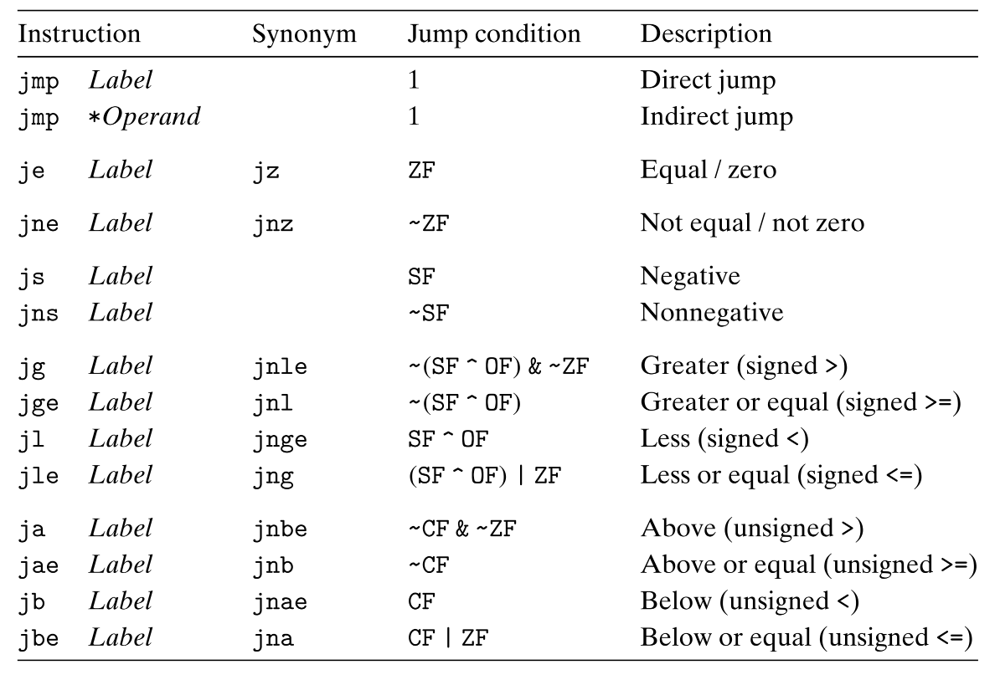
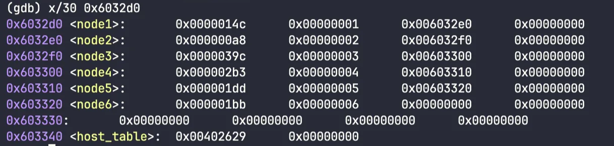

# Bomb Lab

## `Learning Materials`

[chapter 3.pdf](Bomblab/chapter_3.pdf)

# build the environment

- download writeup and material: http://csapp.cs.cmu.edu/3e/labs.html
- objdump -d bomb > output.

# Phase_1

- search phase_1
- see this

```nasm
0000000000400ee0 <phase_1>:
  400ee0:	48 83 ec 08          	sub    $0x8,%rsp ;make a stack space of 8 bytes
  400ee4:	be 00 24 40 00       	mov    $0x402400,%esi ; move the immediate number to %esi, could be an address
  400ee9:	e8 4a 04 00 00       	call   401338 <strings_not_equal>;call the fuction named as <strings_not_equal>
  400eee:	85 c0                	test   %eax,%eax; compare the return value of <strings_not_equal> and itself and will set the ZF register to 1 if the return value is 0
  400ef0:	74 05                	je     400ef7 <phase_1+0x17>; jump to the end of the function if ZF==1
  400ef2:	e8 43 05 00 00       	call   40143a <explode_bomb>
  400ef7:	48 83 c4 08          	add    $0x8,%rsp
  400efb:	c3                   	ret   
```

- think:
    - `<explode_bomb>` is what makes the bomb explode
    - but if we can `je     400ef7 <phase_1+0x17>` then we can avoid it
    - search the book and see the jump condition of `je` is ZF Equal / zero
        - Table: The jump instruction:
          
            
        
    - Before `je` is `test   %eax,%eax` : This instruction sets the Zero Flag (ZF) based on the result of the `test`, which is a bitwise AND operation between `%eax` and itself. Since it’s testing the same register, it essentially checks if `%eax` is zero. If `%eax` is zero after the `strings_not_equal` function call, it means the strings are equal. Then the ZF will be set as 1
    - Now let’s examine the `strings_not_equal` function:
    
    ```nasm
    0000000000401338 <strings_not_equal>:
      401338:	41 54                	push   %r12; Save %r12 on stack (used later to hold string length)
      40133a:	55                   	push   %rbp; Save %rbp on stack (used later to point to one of the strings)
      40133b:	53                   	push   %rbx; Save %rbx on stack (used later to point to the other string)
      40133c:	48 89 fb             	mov    %rdi,%rbx; Move first string address from %rdi to %rbx
      40133f:	48 89 f5             	mov    %rsi,%rbp; Move second string address from %rsi to %rbp
      401342:	e8 d4 ff ff ff       	call   40131b <string_length> ; Call string_length on first string
      401347:	41 89 c4             	mov    %eax,%r12d; Store returned length in %r12d
      40134a:	48 89 ef             	mov    %rbp,%rdi; Move second string address to %rdi for next string_length call
      40134d:	e8 c9 ff ff ff       	call   40131b <string_length> ; Call string_length on second string
      401352:	ba 01 00 00 00       	mov    $0x1,%edx; Set %edx to 1 (assume strings are not equal)
      401357:	41 39 c4             	cmp    %eax,%r12d; Compare lengths of both strings
      40135a:	75 3f                	jne    40139b <strings_not_equal+0x63> ; If lengths differ, jump to end (return 1)
      40135c:	0f b6 03             	movzbl (%rbx),%eax; Load first byte of first string into %eax
      40135f:	84 c0                	test   %al,%al; Test if character is null (end of string)
      401361:	74 25                	je     401388 <strings_not_equal+0x50> ; If null, jump to setting result to 0 (equal)
      401363:	3a 45 00             	cmp    0x0(%rbp),%al; Compare character from both strings
      401366:	74 0a                	je     401372 <strings_not_equal+0x3a> ; If equal, continue to next character
      401368:	eb 25                	jmp    40138f <strings_not_equal+0x57> ; If not equal, jump to setting result to 1 (not equal)
      40136a:	3a 45 00             	cmp    0x0(%rbp),%al; Compare characters again (part of loop)
      40136d:	0f 1f 00             	nopl   (%rax); No operation, used for alignment
      401370:	75 24                	jne    401396 <strings_not_equal+0x5e> ; If characters not equal, jump to setting result to 1
      401372:	48 83 c3 01          	add    $0x1,%rbx; Increment pointer to first string
      401376:	48 83 c5 01          	add    $0x1,%rbp; Increment pointer to second string
      40137a:	0f b6 03             	movzbl (%rbx),%eax; Load next character of first string
      40137d:	84 c0                	test   %al,%al; Test if character is null
      40137f:	75 e9                	jne    40136a <strings_not_equal+0x32> ; If not null, continue loop
      401381:	ba 00 00 00 00       	mov    $0x0,%edx; Set result to 0 (strings are equal)
      401386:	eb 13                	jmp    40139b <strings_not_equal+0x63> ; Jump to end
      401388:	ba 00 00 00 00       	mov    $0x0,%edx; Set result to 0 (strings are equal)
      40138d:	eb 0c                	jmp    40139b <strings_not_equal+0x63> ; Jump to end
      40138f:	ba 01 00 00 00       	mov    $0x1,%edx; Set result to 1 (strings are not equal)
      401394:	eb 05                	jmp    40139b <strings_not_equal+0x63> ; Jump to end
      401396:	ba 01 00 00 00       	mov    $0x1,%edx; Set result to 1 (strings are not equal)
      40139b:	89 d0                	mov    %edx,%eax; Move result to %eax (return value)
      40139d:	5b                   	pop    %rbx
      40139e:	5d                   	pop    %rbp
      40139f:	41 5c                	pop    %r12
      4013a1:	c3                   	ret
    ```
    
    - The input string should match the string whose first character is stored at address $0x402400.
    - In GDB, we set a breakpoint at phase_1 using the command `b phase_1`. We then use `x/s $0x402400` to view the string. The correct answer is: *Border relations with Canada have never been better.*
    - To avoid repeated inputs, we can create a text file named answer.txt to store the answers, then use `./bomb answer.txt` to run the program.

# Phase_2

- search phase_2
- see this
  
    ```nasm
    00000400efc <phase_2>:
      400efc:	55                   	push   %rbp ;Save %rbp on stack(later used to ?)
      400efd:	53                   	push   %rbx  ;Save %ebx on stack(later used to ?)
      400efe:	48 83 ec 28          	sub    $0x28,%rsp;open a stack space of 0x28 bytes which is 24 bytes, and that will be a room for 6 int numbers
      400f02:	48 89 e6             	mov    %rsp,%rsi;move the address of the stack top to %rsi which will be used as the second argument in the next function
      400f05:	e8 52 05 00 00       	call   40145c <read_six_numbers>; call the function <read_six_numbers>
     
      400f0a:	83 3c 24 01          	cmpl   $0x1,(%rsp);compare the content in %rsp with 0x1 which is (%rsp)-0x1 and it will set ZF to 1 if (%rsp)==0x1
      400f0e:	74 20                	je     400f30 <phase_2+0x34> ;jump to 400f30 if ZF==1, so to avoid bomb (%rsp) must be equal to 1
      400f10:	e8 25 05 00 00       	call   40143a <explode_bomb>
      400f15:	eb 19                	jmp    400f30 <phase_2+0x34>
      400f17:	8b 43 fc             	mov    -0x4(%rbx),%eax ; move the content of the previous number in %eax
      400f1a:	01 c0                	add    %eax,%eax; %eax will be 2 in the first loop and 4 in the second loop
      400f1c: 39 03                 cmp    %eax,(%rbx); compare the content in (%rbx) with %eax and it will set ZF to 1 if (%rbx)==%eax
      400f1e:	74 05                	je     400f25 <phase_2+0x29>;jump to 400f25 if ZF==1, so to avoid bomb (%rbx)must==%eax
      400f20:	e8 15 05 00 00       	call   40143a <explode_bomb>
      400f25:	48 83 c3 04          	add    $0x4,%rbx;%rbx will be %rbx+4 which is the address for the next number
      400f29:	48 39 eb             	cmp    %rbp,%rbx;compare %rbp with %rbx
      400f2c:	75 e9                	jne    400f17 <phase_2+0x1b> ;if %rbp==%rbx then it is over, if they are not equal will go to 400f17
      400f2e:	eb 0c                	jmp    400f3c <phase_2+0x40>
      400f30:	48 8d 5c 24 04       	lea    0x4(%rsp),%rbx; load the sencond number's address in %rbx
      400f35:	48 8d 6c 24 18       	lea    0x18(%rsp),%rbp; load the last number's address in %rbp
      400f3a:	eb db                	jmp    400f17 <phase_2+0x1b>
      400f3c:	48 83 c4 28          	add    $0x28,%rsp
      400f40:	5b                   	pop    %rbx
      400f41:	5d                   	pop    %rbp
      400f42:	c3                   	ret
    ```
    
    ```nasm
    000000000040145c <read_six_numbers>:
      40145c:	48 83 ec 18          	sub    $0x18,%rsp ;open a stack space of 0x18 bytes which can store 6 int numbers
      401460:	48 89 f2             	mov    %rsi,%rdx ;move the stack top of the first fuction to %rdx
      401463:	48 8d 4e 04          	lea    0x4(%rsi),%rcx
      401467:	48 8d 46 14          	lea    0x14(%rsi),%rax
      40146b:	48 89 44 24 08       	mov    %rax,0x8(%rsp)
      401470:	48 8d 46 10          	lea    0x10(%rsi),%rax
      401474:	48 89 04 24          	mov    %rax,(%rsp)
      401478:	4c 8d 4e 0c          	lea    0xc(%rsi),%r9
      40147c:	4c 8d 46 08          	lea    0x8(%rsi),%r8
      401480:	be c3 25 40 00       	mov    $0x4025c3,%esi
      401485:	b8 00 00 00 00       	mov    $0x0,%eax
      40148a:	e8 61 f7 ff ff       	call   400bf0 <__isoc99_sscanf@plt>
      40148f:	83 f8 05             	cmp    $0x5,%eax
      401492:	7f 05                	jg     401499 <read_six_numbers+0x3d>;%eax>5
      401494:	e8 a1 ff ff ff       	call   40143a <explode_bomb>
      401499:	48 83 c4 18          	add    $0x18,%rsp
      40149d:	c3                   	ret 
    ```
    
    - Based on the analysis above the answer should be 12481632
    - And use `x/s 0x4025c3` to see the format of `<__isoc99_sscanf@plt>` and we can see `"%d %d %d %d %d %d"`
    - So the answer should be *1 2 4 8 16 32*

# Phase_3

- search phase_3
- see this
  
    ```nasm
    0000000000400f43 <phase_3>:
      400f43:	48 83 ec 18          	sub    $0x18,%rsp; open a stack space of 24bytes
      400f47:	48 8d 4c 24 0c       	lea    0xc(%rsp),%rcx;read the address of %rsp+12 to %rcx
      400f4c:	48 8d 54 24 08       	lea    0x8(%rsp),%rdx;read the address of %rsp+8 to %rcx
      400f51:	be cf 25 40 00       	mov    $0x4025cf,%esi%;read the format of sscanf and it is "%d %d"
      400f56:	b8 00 00 00 00       	mov    $0x0,%eax%;set the return value to 0
      400f5b:	e8 90 fc ff ff       	call   400bf0 <__isoc99_sscanf@plt>
      400f60:	83 f8 01             	cmp    $0x1,%eax%;compare the return value to 1 
      400f63:	7f 05                	jg     400f6a <phase_3+0x27>;jump if %eax is greater than 1
      400f65:	e8 d0 04 00 00       	call   40143a <explode_bomb>
      400f6a:	83 7c 24 08 07       	cmpl   $0x7,0x8(%rsp);compare the value of 0x8(%rsp) with 0x7
      400f6f:	77 3c                	ja     400fad <phase_3+0x6a>;jump if %eax is greater than 7 and the bomb will explode accoding to the lines below
      400f71:	8b 44 24 08          	mov    0x8(%rsp),%eax;move the the value of 0x8(%rsp) to %eax
      400f75:	ff 24 c5 70 24 40 00 	jmp    *0x402470(,%rax,8); we input value 2 33 to the answer.txt and gdb the code, and i find that the value of 0x8(%rsp) is 2; and it jumps to 0x400f83
      400f7c:	b8 cf 00 00 00       	mov    $0xcf,%eax
      400f81:	eb 3b                	jmp    400fbe <phase_3+0x7b>
      400f83:	b8 c3 02 00 00       	mov    $0x2c3,%eax;move the the value 0x2c3 to %eax
      400f88:	eb 34                	jmp    400fbe <phase_3+0x7b>
      400f8a:	b8 00 01 00 00       	mov    $0x100,%eax
      400f8f:	eb 2d                	jmp    400fbe <phase_3+0x7b>
      400f91:	b8 85 01 00 00       	mov    $0x185,%eax
      400f96:	eb 26                	jmp    400fbe <phase_3+0x7b>
      400f98:	b8 ce 00 00 00       	mov    $0xce,%eax
      400f9d:	eb 1f                	jmp    400fbe <phase_3+0x7b>
      400f9f:	b8 aa 02 00 00       	mov    $0x2aa,%eax
      400fa4:	eb 18                	jmp    400fbe <phase_3+0x7b>
      400fa6:	b8 47 01 00 00       	mov    $0x147,%eax
      400fab:	eb 11                	jmp    400fbe <phase_3+0x7b>
      400fad:	e8 88 04 00 00       	call   40143a <explode_bomb>
      400fb2:	b8 00 00 00 00       	mov    $0x0,%eax
      400fb7:	eb 05                	jmp    400fbe <phase_3+0x7b>
      400fb9:	b8 37 01 00 00       	mov    $0x137,%eax
      400fbe:	3b 44 24 0c          	cmp    0xc(%rsp),%eax;compare 0xc(%rsp) with %eax, use gdb find that 0xc(%rsp) is 33, so we should set the second number to 0x2c3 and use p 0x2c3 find out it should be decimal 707
      400fc2:	74 05                	je     400fc9 <phase_3+0x86>
      400fc4:	e8 71 04 00 00       	call   40143a <explode_bomb>
      400fc9:	48 83 c4 18          	add    $0x18,%rsp
      400fcd:	c3                   	ret
    ```
    
    - Debug log
      
        ```bash
        (gdb) b phase_3
        Breakpoint 1 at 0x400f43
        (gdb) r answer.txt
        Starting program: /home/project/KuiperLLama/CSAPP/bomb/bomb answer.txt
        warning: Error disabling address space randomization: Operation not permitted
        [Thread debugging using libthread_db enabled]
        Using host libthread_db library "/lib/x86_64-linux-gnu/libthread_db.so.1".
        Welcome to my fiendish little bomb. You have 6 phases with
        which to blow yourself up. Have a nice day!
        Phase 1 defused. How about the next one?
        That's number 2.  Keep going!
        
        Breakpoint 1, 0x0000000000400f43 in phase_3 ()
        (gdb) stepi
        0x0000000000400f47 in phase_3 ()
        (gdb) 
        0x0000000000400f4c in phase_3 ()
        (gdb) display/5i $pc
        1: x/5i $pc
        => 0x400f4c <phase_3+9>:        lea    0x8(%rsp),%rdx
           0x400f51 <phase_3+14>:       mov    $0x4025cf,%esi
           0x400f56 <phase_3+19>:       mov    $0x0,%eax
           0x400f5b <phase_3+24>:       call   0x400bf0 <__isoc99_sscanf@plt>
           0x400f60 <phase_3+29>:       cmp    $0x1,%eax
        (gdb) stepi
        0x0000000000400f51 in phase_3 ()
        1: x/5i $pc
        => 0x400f51 <phase_3+14>:       mov    $0x4025cf,%esi
           0x400f56 <phase_3+19>:       mov    $0x0,%eax
           0x400f5b <phase_3+24>:       call   0x400bf0 <__isoc99_sscanf@plt>
           0x400f60 <phase_3+29>:       cmp    $0x1,%eax
           0x400f63 <phase_3+32>:       jg     0x400f6a <phase_3+39>
        (gdb) 
        0x0000000000400f56 in phase_3 ()
        1: x/5i $pc
        => 0x400f56 <phase_3+19>:       mov    $0x0,%eax
           0x400f5b <phase_3+24>:       call   0x400bf0 <__isoc99_sscanf@plt>
           0x400f60 <phase_3+29>:       cmp    $0x1,%eax
           0x400f63 <phase_3+32>:       jg     0x400f6a <phase_3+39>
           0x400f65 <phase_3+34>:       call   0x40143a <explode_bomb>
        (gdb) 
        0x0000000000400f5b in phase_3 ()
        1: x/5i $pc
        => 0x400f5b <phase_3+24>:       call   0x400bf0 <__isoc99_sscanf@plt>
           0x400f60 <phase_3+29>:       cmp    $0x1,%eax
           0x400f63 <phase_3+32>:       jg     0x400f6a <phase_3+39>
           0x400f65 <phase_3+34>:       call   0x40143a <explode_bomb>
           0x400f6a <phase_3+39>:       cmpl   $0x7,0x8(%rsp)
        (gdb) 
        0x0000000000400bf0 in __isoc99_sscanf@plt ()
        1: x/5i $pc
        => 0x400bf0 <__isoc99_sscanf@plt>:      jmp    *0x202492(%rip)        # 0x603088 <__isoc99_sscanf@got.plt>
           0x400bf6 <__isoc99_sscanf@plt+6>:    push   $0x11
           0x400bfb <__isoc99_sscanf@plt+11>:   jmp    0x400ad0
           0x400c00 <__printf_chk@plt>: jmp    *0x20248a(%rip)        # 0x603090 <__printf_chk@got.plt>
           0x400c06 <__printf_chk@plt+6>:       push   $0x12
        (gdb) finish
        Run till exit from #0  0x0000000000400bf0 in __isoc99_sscanf@plt ()
        0x0000000000400f60 in phase_3 ()
        1: x/5i $pc
        => 0x400f60 <phase_3+29>:       cmp    $0x1,%eax
           0x400f63 <phase_3+32>:       jg     0x400f6a <phase_3+39>
           0x400f65 <phase_3+34>:       call   0x40143a <explode_bomb>
           0x400f6a <phase_3+39>:       cmpl   $0x7,0x8(%rsp)
           0x400f6f <phase_3+44>:       ja     0x400fad <phase_3+106>
        (gdb) stepi
        0x0000000000400f63 in phase_3 ()
        1: x/5i $pc
        => 0x400f63 <phase_3+32>:       jg     0x400f6a <phase_3+39>
           0x400f65 <phase_3+34>:       call   0x40143a <explode_bomb>
           0x400f6a <phase_3+39>:       cmpl   $0x7,0x8(%rsp)
           0x400f6f <phase_3+44>:       ja     0x400fad <phase_3+106>
           0x400f71 <phase_3+46>:       mov    0x8(%rsp),%eax
        (gdb) 
        0x0000000000400f6a in phase_3 ()
        1: x/5i $pc
        => 0x400f6a <phase_3+39>:       cmpl   $0x7,0x8(%rsp)
           0x400f6f <phase_3+44>:       ja     0x400fad <phase_3+106>
           0x400f71 <phase_3+46>:       mov    0x8(%rsp),%eax
           0x400f75 <phase_3+50>:       jmp    *0x402470(,%rax,8)
           0x400f7c <phase_3+57>:       mov    $0xcf,%eax
        (gdb) 
        0x0000000000400f6f in phase_3 ()
        1: x/5i $pc
        => 0x400f6f <phase_3+44>:       ja     0x400fad <phase_3+106>
           0x400f71 <phase_3+46>:       mov    0x8(%rsp),%eax
           0x400f75 <phase_3+50>:       jmp    *0x402470(,%rax,8)
           0x400f7c <phase_3+57>:       mov    $0xcf,%eax
           0x400f81 <phase_3+62>:       jmp    0x400fbe <phase_3+123>
        (gdb) 
        0x0000000000400f71 in phase_3 ()
        1: x/5i $pc
        => 0x400f71 <phase_3+46>:       mov    0x8(%rsp),%eax
           0x400f75 <phase_3+50>:       jmp    *0x402470(,%rax,8)
           0x400f7c <phase_3+57>:       mov    $0xcf,%eax
           0x400f81 <phase_3+62>:       jmp    0x400fbe <phase_3+123>
           0x400f83 <phase_3+64>:       mov    $0x2c3,%eax
        (gdb) 
        0x0000000000400f75 in phase_3 ()
        1: x/5i $pc
        => 0x400f75 <phase_3+50>:       jmp    *0x402470(,%rax,8)
           0x400f7c <phase_3+57>:       mov    $0xcf,%eax
           0x400f81 <phase_3+62>:       jmp    0x400fbe <phase_3+123>
           0x400f83 <phase_3+64>:       mov    $0x2c3,%eax
           0x400f88 <phase_3+69>:       jmp    0x400fbe <phase_3+123>
        (gdb) 
        0x0000000000400f83 in phase_3 ()
        1: x/5i $pc
        => 0x400f83 <phase_3+64>:       mov    $0x2c3,%eax
           0x400f88 <phase_3+69>:       jmp    0x400fbe <phase_3+123>
           0x400f8a <phase_3+71>:       mov    $0x100,%eax
           0x400f8f <phase_3+76>:       jmp    0x400fbe <phase_3+123>
           0x400f91 <phase_3+78>:       mov    $0x185,%eax
        (gdb) p 0x2c3
        $1 = 707
        (gdb) stepi
        0x0000000000400f88 in phase_3 ()
        1: x/5i $pc
        => 0x400f88 <phase_3+69>:       jmp    0x400fbe <phase_3+123>
           0x400f8a <phase_3+71>:       mov    $0x100,%eax
           0x400f8f <phase_3+76>:       jmp    0x400fbe <phase_3+123>
           0x400f91 <phase_3+78>:       mov    $0x185,%eax
           0x400f96 <phase_3+83>:       jmp    0x400fbe <phase_3+123>
        (gdb) 
        0x0000000000400fbe in phase_3 ()
        1: x/5i $pc
        => 0x400fbe <phase_3+123>:      cmp    0xc(%rsp),%eax
           0x400fc2 <phase_3+127>:      je     0x400fc9 <phase_3+134>
           0x400fc4 <phase_3+129>:      call   0x40143a <explode_bomb>
           0x400fc9 <phase_3+134>:      add    $0x18,%rsp
           0x400fcd <phase_3+138>:      ret    
        (gdb) 
        0x0000000000400fc2 in phase_3 ()
        1: x/5i $pc
        => 0x400fc2 <phase_3+127>:      je     0x400fc9 <phase_3+134>
           0x400fc4 <phase_3+129>:      call   0x40143a <explode_bomb>
           0x400fc9 <phase_3+134>:      add    $0x18,%rsp
           0x400fcd <phase_3+138>:      ret    
           0x400fce <func4>:    sub    $0x8,%rsp
        ```

# Phase_4

- search phase_4
- see this
  
    ```nasm
    000000000040100c <phase_4>:
      40100c:	48 83 ec 18          	sub    $0x18,%rsp; open a stack space of 24bytes
      401010:	48 8d 4c 24 0c       	lea    0xc(%rsp),%rcx; read the address of %rsp+12 to %rcx
      401015:	48 8d 54 24 08       	lea    0x8(%rsp),%rdx; read the address of %rsp+8 to %rcx
      40101a:	be cf 25 40 00       	mov    $0x4025cf,%esi; read the format of sscanf and it is "%d %d" and i put 2 and 2 in the answer.txt
      40101f:	b8 00 00 00 00       	mov    $0x0,%eax
      401024:	e8 c7 fb ff ff       	call   400bf0 <__isoc99_sscanf@plt>
      401029:	83 f8 02             	cmp    $0x2,%eax; the return value should be 2
      40102c:	75 07                	jne    401035 <phase_4+0x29>
      40102e:	83 7c 24 08 0e       	cmpl   $0xe,0x8(%rsp)
      401033:	76 05                	jbe    40103a <phase_4+0x2e>; jump if 0x8(%rsp) is <= 0xe ,so the first_input should <= 0xe
      401035:	e8 00 04 00 00       	call   40143a <explode_bomb>
      40103a:	ba 0e 00 00 00       	mov    $0xe,%edx;third argument of function 4 is 0xe
      40103f:	be 00 00 00 00       	mov    $0x0,%esi;second argument of func 4 is 0x0
      401044:	8b 7c 24 08          	mov    0x8(%rsp),%edi;first argument of func 4 is 0xfirst_input
      401048:	e8 81 ff ff ff       	call   400fce <func4>
      40104d:	85 c0                	test   %eax,%eax;func4 should return 0
      40104f:	75 07                	jne    401058 <phase_4+0x4c>
      401051:	83 7c 24 0c 00       	cmpl   $0x0,0xc(%rsp);the second input should be 0x0
      401056:	74 05                	je     40105d <phase_4+0x51>
      401058:	e8 dd 03 00 00       	call   40143a <explode_bomb>
      40105d:	48 83 c4 18          	add    $0x18,%rsp
      401061:	c3                   	ret 
    ```
    
    ```nasm
    0000000000400fce <func4>:
      400fce:	48 83 ec 08          	sub    $0x8,%rsp;(x=first_input,y=0x0,z=0xe)
      400fd2:	89 d0                	mov    %edx,%eax;eax=0xe (a=z)
      400fd4:	29 f0                	sub    %esi,%eax;eax=0xe-0x0=0xe (a=a-y)
      400fd6:	89 c1                	mov    %eax,%ecx;ecx=0xe(c=a)
      400fd8:	c1 e9 1f             	shr    $0x1f,%ecx;logical right shift, and ecx will be 0x0(c= c>>L31)
      400fdb:	01 c8                	add    %ecx,%eax;eax=0xe (a=a+c)
      400fdd:	d1 f8                	sar    %eax;arithmetic right shift 1 bit (a=a>>A1) eax=7 (00..1110)->(00..0111)
      400fdf:	8d 0c 30             	lea    (%rax,%rsi,1),%ecx;(c=a+y)
      400fe2:	39 f9                	cmp    %edi,%ecx;x==c? x=first_input c=7
      400fe4:	7e 0c                	jle    400ff2 <func4+0x24>; if c<=first_input
      400fe6:	8d 51 ff             	lea    -0x1(%rcx),%edx;
      400fe9:	e8 e0 ff ff ff       	call   400fce <func4>
      400fee:	01 c0                	add    %eax,%eax
      400ff0:	eb 15                	jmp    401007 <func4+0x39>
      400ff2:	b8 00 00 00 00       	mov    $0x0,%eax;a=0
      400ff7:	39 f9                	cmp    %edi,%ecx;cmp x and c
      400ff9:	7d 0c                	jge    401007 <func4+0x39>;if c>=first_input quit
      400ffb:	8d 71 01             	lea    0x1(%rcx),%esi
      400ffe:	e8 cb ff ff ff       	call   400fce <func4>
      401003:	8d 44 00 01          	lea    0x1(%rax,%rax,1),%eax
      401007:	48 83 c4 08          	add    $0x8,%rsp
      40100b:	c3                   	ret 
    ```

# Phase_5

- search phase_5
- see this
  
    ```nasm
    0000000000401062 <phase_5>:
      401062:	53                   	push   %rbx
      401063:	48 83 ec 20          	sub    $0x20,%rsp
      401067:	48 89 fb             	mov    %rdi,%rbx;move the address of the first letter into %rbx
      40106a:	64 48 8b 04 25 28 00 	mov    %fs:0x28,%rax;Retrieve canary
      401071:	00 00 
      401073:	48 89 44 24 18       	mov    %rax,0x18(%rsp);Store on stack
      401078:	31 c0                	xor    %eax,%eax;Zero out register
      40107a:	e8 9c 02 00 00       	call   40131b <string_length>
      40107f:	83 f8 06             	cmp    $0x6,%eax; should be a string of 6 letters
      401082:	74 4e                	je     4010d2 <phase_5+0x70>
      401084:	e8 b1 03 00 00       	call   40143a <explode_bomb>
      401089:	eb 47                	jmp    4010d2 <phase_5+0x70>
      40108b:	0f b6 0c 03          	movzbl (%rbx,%rax,1),%ecx;(%rbx+%rax)->%ecx
      40108f:	88 0c 24             	mov    %cl,(%rsp);move the first letter's address to (%rsp)
      401092:	48 8b 14 24          	mov    (%rsp),%rdx;move the first letter's address to (%rsp) to %rdx
      401096:	83 e2 0f             	and    $0xf,%edx;set the high four bits to zero 
      401099:	0f b6 92 b0 24 40 00 	movzbl 0x4024b0(%rdx),%edx;use x/s 0x4024b0 and we see "maduiersnfotvbylSo you think you can stop the bomb with ctrl-c,do you?"
      4010a0:	88 54 04 10          	mov    %dl,0x10(%rsp,%rax,1)
      4010a4:	48 83 c0 01          	add    $0x1,%rax
      4010a8:	48 83 f8 06          	cmp    $0x6,%rax
      4010ac:	75 dd                	jne    40108b <phase_5+0x29>
      4010ae:	c6 44 24 16 00       	movb   $0x0,0x16(%rsp)
      4010b3:	be 5e 24 40 00       	mov    $0x40245e,%esi ;"flyers" f:9 l:15 y:14 e:5 r:6 s:7 and all add 0x60 since 0x60 is bigger than 0x10 and that will be f:(i) l:(o) y:(n) e:(e) r:(f) s:(g)
      4010b8:	48 8d 7c 24 10       	lea    0x10(%rsp),%rdi
      4010bd:	e8 76 02 00 00       	call   401338 <strings_not_equal>
      4010c2:	85 c0                	test   %eax,%eax
      4010c4:	74 13                	je     4010d9 <phase_5+0x77>
      4010c6:	e8 6f 03 00 00       	call   40143a <explode_bomb>
      4010cb:	0f 1f 44 00 00       	nopl   0x0(%rax,%rax,1)
      4010d0:	eb 07                	jmp    4010d9 <phase_5+0x77>
      4010d2:	b8 00 00 00 00       	mov    $0x0,%eax
      4010d7:	eb b2                	jmp    40108b <phase_5+0x29>
      4010d9:	48 8b 44 24 18       	mov    0x18(%rsp),%rax
      4010de:	64 48 33 04 25 28 00 	xor    %fs:0x28,%rax;Compare to stored value
      4010e5:	00 00 
      4010e7:	74 05                	je     4010ee <phase_5+0x8c>
      4010e9:	e8 42 fa ff ff       	call   400b30 <__stack_chk_fail@plt>
      4010ee:	48 83 c4 20          	add    $0x20,%rsp
      4010f2:	5b                   	pop    %rbx
      4010f3:	c3                   	ret  
    ```

# Phase_6

- search phase_6
- see this
  
    ```nasm
    00000000004010f4 <phase_6>:
      4010f4:	41 56                	push   %r14
      4010f6:	41 55                	push   %r13
      4010f8:	41 54                	push   %r12
      4010fa:	55                   	push   %rbp
      4010fb:	53                   	push   %rbx
      4010fc:	48 83 ec 50          	sub    $0x50,%rsp
      401100:	49 89 e5             	mov    %rsp,%r13;%rsp->%r13
      401103:	48 89 e6             	mov    %rsp,%rsi;%rsp->%rsi
      401106:	e8 51 03 00 00       	call   40145c <read_six_numbers>
      40110b:	49 89 e6             	mov    %rsp,%r14;%rsp->%r14
      40110e:	41 bc 00 00 00 00    	mov    $0x0,%r12d;%r12d=0
      401114:	4c 89 ed             	mov    %r13,%rbp;r13->p
      401117:	41 8b 45 00          	mov    0x0(%r13),%eax;the first_input->%eax
      40111b:	83 e8 01             	sub    $0x1,%eax
      40111e:	83 f8 05             	cmp    $0x5,%eax
      401121:	76 05                	jbe    401128 <phase_6+0x34>;jump if eax<=5 (first_input-1)<=5
      401123:	e8 12 03 00 00       	call   40143a <explode_bomb>
      401128:	41 83 c4 01          	add    $0x1,%r12d;r12d+1
      40112c:	41 83 fc 06          	cmp    $0x6,%r12d
      401130:	74 21                	je     401153 <phase_6+0x5f>;jump if r12d==6
      401132:	44 89 e3             	mov    %r12d,%ebx;1
      401135:	48 63 c3             	movslq %ebx,%rax;1 2
      401138:	8b 04 84             	mov    (%rsp,%rax,4),%eax;rsp+4 eax->second_input third_input
      40113b:	39 45 00             	cmp    %eax,0x0(%rbp);second_input?first_input
      40113e:	75 05                	jne    401145 <phase_6+0x51>;second_input!=first_input third_input?first_input
      401140:	e8 f5 02 00 00       	call   40143a <explode_bomb>
      401145:	83 c3 01             	add    $0x1,%ebx;2
      401148:	83 fb 05             	cmp    $0x5,%ebx
      40114b:	7e e8                	jle    401135 <phase_6+0x41>;so till now we can see the rest numbers should not be equal to the first number
      40114d:	49 83 c5 04          	add    $0x4,%r13;r13+4
      401151:	eb c1                	jmp    401114 <phase_6+0x20>;so till now we can see the rest numbers should not be equal to each other and they are all <=6
      401153:	48 8d 74 24 18       	lea    0x18(%rsp),%rsi; the address of 0x18(%rsp) 0 4 8 c 10 14 18
      401158:	4c 89 f0             	mov    %r14,%rax;first_input->rax 1
      40115b:	b9 07 00 00 00       	mov    $0x7,%ecx;ecx=7
      401160:	89 ca                	mov    %ecx,%edx;ecx->edx 7
      401162:	2b 10                	sub    (%rax),%edx;7-first_input 6
      401164:	89 10                	mov    %edx,(%rax);7-first_input->rax 6->rax
      401166:	48 83 c0 04          	add    $0x4,%rax;second_input
      40116a:	48 39 f0             	cmp    %rsi,%rax;cmp rax+4 and the address of 0x18(%rsp) 
      40116d:	75 f1                	jne    401160 <phase_6+0x6c>
      40116f:	be 00 00 00 00       	mov    $0x0,%esi;till now we make every input 7-itself
      401174:	eb 21                	jmp    401197 <phase_6+0xa3>
      401176:	48 8b 52 08          	mov    0x8(%rdx),%rdx;use x (0x6032d0+0x8) to find out that now is 0x6032e0 in rdx
      40117a:	83 c0 01             	add    $0x1,%eax;eax=2
      40117d:	39 c8                	cmp    %ecx,%eax;ecx=6
      40117f:	75 f5                	jne    401176 <phase_6+0x82>
      401181:	eb 05                	jmp    401188 <phase_6+0x94>
      401183:	ba d0 32 60 00       	mov    $0x6032d0,%edx
      401188:	48 89 54 74 20       	mov    %rdx,0x20(%rsp,%rsi,2)
      40118d:	48 83 c6 04          	add    $0x4,%rsi
      401191:	48 83 fe 18          	cmp    $0x18,%rsi
      401195:	74 14                	je     4011ab <phase_6+0xb7>
      401197:	8b 0c 34             	mov    (%rsp,%rsi,1),%ecx; the first_input is in ecx 
      40119a:	83 f9 01             	cmp    $0x1,%ecx;
      40119d:	7e e4                	jle    401183 <phase_6+0x8f>
      40119f:	b8 01 00 00 00       	mov    $0x1,%eax;eax=1
      4011a4:	ba d0 32 60 00       	mov    $0x6032d0,%edx;edx=0x6032d0,use x/30 0x6032d0 see many node
      4011a9:	eb cb                	jmp    401176 <phase_6+0x82>
      4011ab:	48 8b 5c 24 20       	mov    0x20(%rsp),%rbx
      4011b0:	48 8d 44 24 28       	lea    0x28(%rsp),%rax
      4011b5:	48 8d 74 24 50       	lea    0x50(%rsp),%rsi
      4011ba:	48 89 d9             	mov    %rbx,%rcx
      4011bd:	48 8b 10             	mov    (%rax),%rdx
      4011c0:	48 89 51 08          	mov    %rdx,0x8(%rcx)
      4011c4:	48 83 c0 08          	add    $0x8,%rax
      4011c8:	48 39 f0             	cmp    %rsi,%rax
      4011cb:	74 05                	je     4011d2 <phase_6+0xde>
      4011cd:	48 89 d1             	mov    %rdx,%rcx
      4011d0:	eb eb                	jmp    4011bd <phase_6+0xc9>
      4011d2:	48 c7 42 08 00 00 00 	movq   $0x0,0x8(%rdx)
      4011d9:	00 
      4011da:	bd 05 00 00 00       	mov    $0x5,%ebp
      4011df:	48 8b 43 08          	mov    0x8(%rbx),%rax
      4011e3:	8b 00                	mov    (%rax),%eax
      4011e5:	39 03                	cmp    %eax,(%rbx)
      4011e7:	7d 05                	jge    4011ee <phase_6+0xfa>;jump if (%rbx)>=eax the vaule in the first node should be greater than the sceond 
      4011e9:	e8 4c 02 00 00       	call   40143a <explode_bomb>
      4011ee:	48 8b 5b 08          	mov    0x8(%rbx),%rbx
      4011f2:	83 ed 01             	sub    $0x1,%ebp;%ebp=%ebp-0x1
      4011f5:	75 e8                	jne    4011df <phase_6+0xeb>
      4011f7:	48 83 c4 50          	add    $0x50,%rsp
      4011fb:	5b                   	pop    %rbx
      4011fc:	5d                   	pop    %rbp
      4011fd:	41 5c                	pop    %r12
      4011ff:	41 5d                	pop    %r13
      401201:	41 5e                	pop    %r14
      401203:	c3                   	ret    
    ```
    
    
    
    [https://www.figma.com/board/84RRVlWuFOpSd1blieO2UM/Untitled?node-id=0-1&node-type=canvas&t=rpPUEiOLDCyY9mXf-0](https://www.figma.com/board/84RRVlWuFOpSd1blieO2UM/Untitled?node-id=0-1&node-type=canvas&t=rpPUEiOLDCyY9mXf-0)
    

# Summary

- Thoughts
    - Above all, this experiment is fascinating. It allowed me to utilize all the knowledge I've learned but could easily forget. During class, I often overlooked details, but after this experiment, I can now recall many commonly used registers, their functions, and various jump conditions for different commands.
    - The debug tool is incredibly valuable! Using different commands like `layout next` and `x/nfu address` greatly improved my efficiency. These tools helped me keep a constant eye on the registers.
    - Drawing diagrams is also extremely helpful when tackling difficult questions. For instance, in the last phase, I created a diagram using [***Figma***](http://Figma.com), which helped me solve the problem.

---